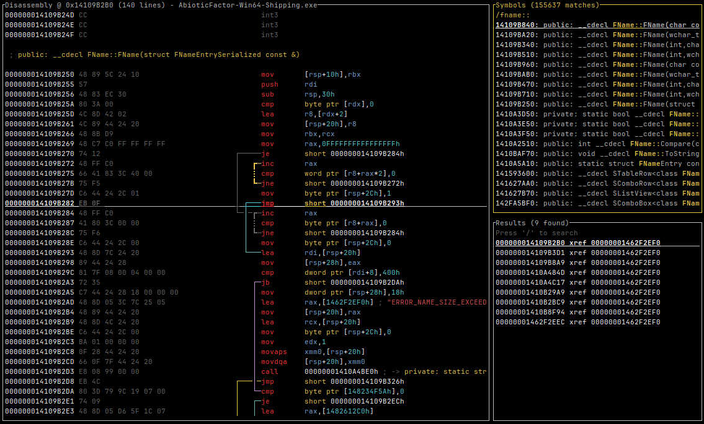

# bustr

A terminal based binary analysis tool built over a weekend to quickly (1-2 seconds) open very large Windows executables (such as Unreal Engine games) and accompanying symbols if present. It includes basic navigation features like following function calls, searching Xrefs to strings, navigating to symbols, etc.. This allows for quick inspection without getting out a heavier tool such as Binary Ninja or IDA64 which may take up to an hour to analyze.



## building

```bash
cargo build --release
```

## usage

```bash
bustr <path-to-binary>
```

## keys

### general
- `q` - Quit
- `?` - Toggle help menu
- `Tab/Shift+Tab` - Switch between panes
- `L` - Toggle debug log view

### movement
- `↑/k` - Scroll up
- `↓/j` - Scroll down
- `PgUp/PgDn` - Page up/down
- `u/d` - Half page up/down
- `g` - Jump to top
- `G` - Jump to bottom
- `h/l` - Navigate back/forward in history

### analysis
- `/` - Search symbols
- `x` - Find cross-references (XRefs) to selection
- `f` - Follow address reference
- `Ctrl+g` - Go to address (hex)
